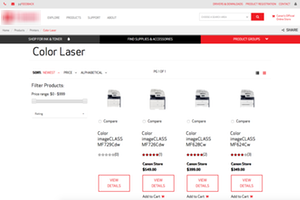
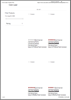
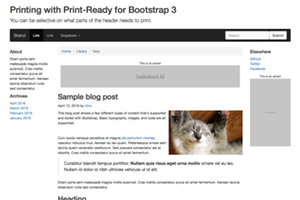
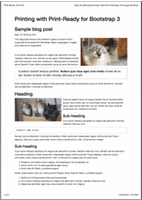

&#128424; Print-Ready
=====================
CSS for printable websites.

----------------------------------------

Preface
-------

It's safe to say that the majority of today's websites are not designed to be
 printed.  Web pages usually look terrible when printed - bad design, often
 with no consideration for printer page layout - render with excessive white
 space, item wrapping across multiple pages, and general malformation of
 output, causing the printed output to generate multiple pages of unusable
 paper.  It's bad for your wallet and it's bad for your brand.

  

This is somewhat confusing as a website is after all a marketing medium - it's
 an advertisement of your brand, and it's content the value that brand
 represents.  How often do you come across a cooking recipe that you want to
 save for later, or a gadget that you want to print to study up on later, or
 show to a friend... or a store clerk.  Or a news article that your want to
 keep.

Modern web browsers can render the same content in different ways depending on
 screen size - this is called *responsive web design*.  This is achieved by
 utilizing CSS' **@media** rule (known as a media query).  But the media query
 also supports rendering content for printing differently.

----------------------------------------

Print-Ready
-----------

Print-Ready is a CSS file that web developers can include into their websites
 to enable for a print ready pages.  With it's styles in a set of classes and
 standard HTML tag overrides, designers can optimize the printing process, as
 well as make the printed pages easier to read.

It is then up to the web developer to clean and format web pages for a perfect
 print experience - removing ads, navigation and other web page junk, so you
 save paper and ink when you print.

  

(*Remember* that this CSS should always be included last, so that the other
 styles can be overwritten.)


CSS and Responsive Frameworks  
-----------------------------

Print-Ready by default hides the visibility of items that have
 no place on a printed page - one cannot *"press"* a button on a piece of paper
 after all.

### HTML Tags

##### Navigational HTML Tags

Navigation tags are always hidden, including:

* `<button>` - General buttons
* `<input type="submit">` - Form Submit button
* `<input type="reset">` - Form Reset button
* `<input type="button">` - Form buttons
* `<nav>` - [HTML5 Navigation][1]<sup>&#x21d7;</sup> groups, like menus and
  side navigation bars.

##### Hyperlinks

Modified print behavior of HTML anchors by appending the actual URL
 to the end of the link text, e.g.

  ```html
  <a href="your url here">Location Name</a>
  ```
Prints as:
  > Location Name &lt; your url here &gt;

##### Abbreviations and Acronyms

  ```html
  ... follow the <abbr title="Uniform Resource Locator">URL</abbr> here ...
  ```
Prints as:
  > ... follow the URL (Uniform Resource Locator) here ...

### CSS Classes

Print-Ready also adds a few classes that enables web developers to hide (or
 show) groupings of content that make sense to not print.  As a general rule
 of thumb, one would exclude in printing the following:

1. Navigational links, like menu bars, side menus etc, document paging and
   pagination.
   * Ask yourself: Does this content only exist to send the browser user to
     another location.
   * In HTML 5 it is recommended to encapsulate this content in a `<nav>` tag -
     these are already hidden.

2. Embedded content - like videos.
   * A standard 80gsm photocopy paper cannot play video.  Provide a link URL if
   you must.

3. Advertising or banner ads.
   * This is maybe a tricky topic (because ads are both navigational and
     informative), but ask yourself:
      * Is this someone else's ad? - then hide it.  (You'll not get paid for
        printed impressions.)
      * Is this ad yours, but time limited, like 'specials'? - the hide it.
        (The prints will last far longer that your special and may not be
        relevant when next read.)
      * Is the ad yours, and the content relevant for the context of the page,
        and doesn't display text like "click here" or "find out more"? - then
        include it.

There is a generic version of the CSS located at
 [`html/css/print-ready.css`][css] in this project.

##### `.noprint` class
  * Aliases `.dont-print` & `.hidden-print`
  * Usage:

    ```html
    <div class="noprint">
        Content
    </div>
    ```

    Will hide the content when printed.


##### `.noscreen` class
  * Alias `.hidden-screen`
  * Usage:

    ```html
    <div class=".noscreen">
        Content
    </div>
    ```

    Will hide the content when displayed on a screen, but will print it.

----------------------------------------

### Features

Print-Ready supports a few popular CSS frameworks, including:

* Twitter Bootstrap 3 [&#x1F517;][3]<sup>&#x21d7;</sup>
* Twitter Bootstrap 4 [&#128279;][4]<sup>&#x21d7;</sup>

----------------------------------------

#### Twitter Bootstrap 3

##### Getting Started

Included in Print-Ready are the Bootstrap add-on stylesheets.

```txt
print-ready/
└── twbs-bootstrap-3/
    └── css/
        ├── bootstrap-pr.css
        ├── bootstrap-pr.css.map
        └── bootstrap-pr.min.css
```

Add the appropriate `bootstrap-pr` CSS file in your webpage or template engine:

```html
<!-- Latest compiled and minified CSS -->
<link rel="stylesheet" href=".../bootstrap.min.css">
<!-- Optional theme -->
<link rel="stylesheet" href=".../bootstrap-theme.min.css">
<!-- Print Ready -->
<!-- (Do not include media="print", Print-Ready is media="all") -->
<link rel="stylesheet" href="css/bootstrap-pr.min.css">
```

&#x26A0; The print ready CSS must be declared after the Bootstrap CSS as it
 overrides select behavior.

Bootstrap 3 is built on Less, thus so is Print-Ready.  The Less source is
 included:

```txt
print-ready/
├── html/
|   └── scss/
|       ├── _printer-ready.scss
|       └── _screen-ready.scss
└── twbs-bootstrap-3/
    ├── less/
    |  ├── bootstrap-pr.less
    |  └── lib/
    |      └── {Contains selected files from the Bootstrap project}
    └── test-page.htm
```

&#x2139; You will need [lessc][8]<sup>&#x21d7;</sup> installed to compile with
 the included `make.sh` OSX Terminal shell script.

&#x2139; The primary sources are SCSS files, but contain no SASS specific items
 and can thus compile as Less.

##### `.container` & `.container-fluid`

Both container classes are made fluid.  i.e. there is no fixed width from the
 print.

##### `.col-pr-*` grid classes

Using a set of `col-pr-*` classes, you can create an override grid system that
  creates a page layout to house your content.  There is also a `col-pr-0`
  class that hides the content from printing.

Usage:
```html
<div class="row">
  <div class="col-xs-12 col-sm-5 col-md-4 col-lg-3 col-pr-0 sidebar">
    .col-xs-12 .col-sm-5 .col-md-4 .col-lg-3 .col-pr-0 .sidebar
    (Will be hidden when printed.)
  </div>
  <div class="col-xs-12 col-sm-7 col-md-8 col-lg-9 col-pr-12 main">
    .col-xs-12 .col-sm-7 .col-md-8 .col-lg-9 .col-pr-12 .main
  </div>
</div>
```
&#9888; The `.col-pr-*` class declaration must appear after the standard
 `.col-*-*` classes as it overrides select behavior.

&#x2139; `.col-pr-pull-*`, `.col-pr-push-*` and `.col-pr-offset-*` classes are
 also provided, including their `.*-0` variants.


#### `.hidden-pr` class

To hide selected content use the `.hidden-pr` (or Bootstrap's own
 `.hidden-print`) class.

Usage:
```html
<span class="hidden-pr">
  This is an advertisement
</span>
```

##### Other classes

The following classes are also overridden to be hidden on printing:

* `div.alert`
* `.btn`
* `.nav`
* `.navbar`
* `.breadcrumb`

----------------------------------------

#### Twitter Bootstrap 4

Mostly the same as for Bootstrap 3, with a few changes listed:

##### CSS files

```txt
print-ready/
└── twbs-bootstrap-4/
    └── css/
        ├── bootstrap-pr.css
        ├── bootstrap-pr.css.map
        └── bootstrap-pr.min.css
```

##### Source

```txt
print-ready/
├── html/
|   └── scss/
|       ├── _printer-ready.scss
|       └── _screen-ready.scss
└── twbs-bootstrap-4/
    ├── scss/
    |  ├── bootstrap-pr.scss
    |  └── lib/
    |      └── {Contains selected files from the Bootstrap [v4-dev] project}
    └── test-page.htm
```

&#x2139; You will need [compass][2]<sup>&#x21d7;</sup> installed to compile
 with the included `make.sh` OSX Terminal shell script.

##### Pull, push and offset

In Bootstrap 4 the grid positional classes have been renamed to
 `.pull-pr-*`, `.push-pr-*` and `.offset-pr-*`, including `.*-0` variants.


----------------------------------------

#### Other CSS Frameworks as <abbr title="Work In Progress">WIP</abbr>

1. Zurb Foundation 6 [&#128279;][6]<sup>&#x21d7;</sup>

#### Frameworks not supported

1. HTML5 Boilerplate  (already has printer support)
2. Skeleton
3. PureCSS

-> Made with &#x2665; by [@vinorod][7]<sup>&#x21d7;</sup> <-

[css]: ./html/css/print-ready.css
[bs3]: ./twbs-bootstrap-3/css/bootstrap-pr.css
[bs4]: ./twbs-bootstrap-4/css/bootstrap-pr.css
[1]: http://www.w3schools.com/tags/tag_nav.asp
[2]: http://compass-style.org
[3]: http://getbootstrap.com
[4]: https://github.com/twbs/bootstrap/tree/v4-dev
[5]: https://github.com/zurb/foundation-sites/tree/V5
[6]: http://foundation.zurb.com
[7]: http://vinorodrigues.com
[8]: http://lesscss.org
