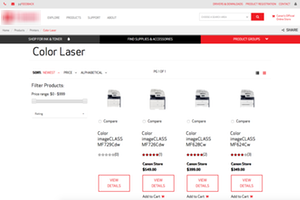
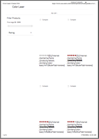

Print-Ready
===========

Preface
-------

It's safe to say that the majority of today's websites are not designed to be
 printed.  Web pages usually look terrible when printed - bad design, often with
 no consideration for printer page layout - render with excessive white space,
 item wrapping across multiple pages, and general malformation of output,
 causing the printed output to generate multiple pages of unusable paper.
 It's bad for your wallet and it's bad for your brand.

  

This is somewhat confusing as a website is after all a marketing medium - it's
 an advertisement of your brand, and it's content the value that brand
 represents.  How often do you come across a cooking recipe that you want to
 save for later, or a gadget that you want to print to study up on later, or
 show to a friend... or a store clerk.  Or a news article that your want to keep.

Modern web browsers can render the same content in different ways depending on
 screen size - this is called *responsive web design*.  This is achieved by
 utilizing CSS' **@media** rule (known as a media query).  But the media query
 also supports rendering content for printing differently.


Print-Ready
-----------

__*Print-Ready*__ is a set of CSS files that allow web developers to include into
 their websites - to enable for a print ready website with a set of classes and
 standard HTML tag overrides to provide some useful print styles that will
 optimize the printing process, as well as make the printed pages easier to
 read.

It is then up to the web developer to clean and format web pages for a perfect
 print experience - removing ads, navigation and other web page junk, so you
 save paper and ink when you print.

(*Remember* that this CSS should always be included last, so that the other
 styles can be overwritten.)


CSS and Responsive Frameworks  
-----------------------------

__*Print-Ready*__ by default hides the visibility of items that have no place
on a printed page - one cannot *"press"* a button on a piece of paper after all.

* `<button>` - General buttons
* `<input type="submit">` - Form Submit button
* `<input type="reset">` - Form Reset button
* `<input type="button">` - Form buttons
* `<nav>` - [HTML5 Navigation](http://www.w3schools.com/tags/tag_nav.asp) groups,
 like menus and side navigation bars.

It modifies the behavior of hyperlinks (or anchors) by appending the actual URL
 to the end of the link text, e.g.
 * `<a href="http://github.com">Github</a>`
 * Prints as:
   - Github &lt; http://github.com &gt;

It also prints out abbreviation and acronym titles in parentheses, e.g.
* `<abbr title="Uniform Resource Locator">URL</abbr>`
* Prints as:
  - URL (Uniform Resource Locator);

It also adds a few classes that enables web developers to hide (or show)
 groupings of content that make sense to not print - like adverts and general
 ancillary content.

* Class `.noprint` (or it's alias `.dont-print`)
  * Usage:
    ```
    <div class="noprint">
        Content
    </div>
    ```
  * Will hide the content when printed.


* Class `.noscreen`
  * Usage:
    ```
    <div class="noscreen">
        Content
    </div>
    ```
  * Will hide the content when displayed on a screen, but will print.


### Features

* __*Print-Ready*__ supports a few popular CSS frameworks, including:
 * [Twitter Bootstrap 3](http://getbootstrap.com)
 * [Twitter Bootstrap 4](https://github.com/twbs/bootstrap/tree/v4-dev)


* Maybe later, or if (someone contributes)
  * Zurb Foundation 5
  * [Zurb Foundation 6](http://foundation.zurb.com)


* Not supported
  * HTML5 Boilerplate  (already has, so no need)
  * Skeleton
  * PureCSS


### Twitter Bootstrap

to do...
